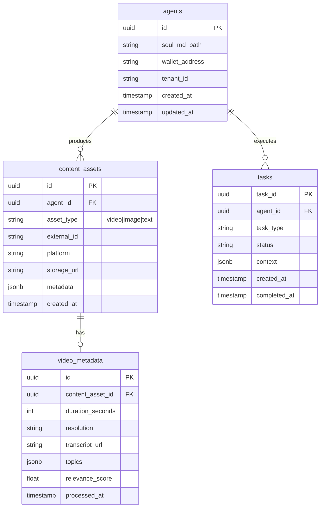

# Technical Specification: API Contracts & Database Schema

**Document**: JSON inputs/outputs for agents; ERD for storage  
**Source**: Project Chimera SRS   
**Last updated**: 2025-02-04

---

## 1. API Contracts (Agent-Facing)

### 1.1 Agent Task (Planner → Worker)

Payload pushed to the task queue (Redis or equivalent). All agents and services MUST conform to this schema.

```json
{
  "task_id": "uuid-v4-string",
  "task_type": "generate_content | reply_comment | execute_transaction | fetch_trends",
  "priority": "high | medium | low",
  "context": {
    "goal_description": "string",
    "persona_constraints": ["string"],
    "required_resources": ["mcp://twitter/mentions/123", "mcp://memory/recent"]
  },
  "assigned_worker_id": "string",
  "created_at": "ISO8601 timestamp",
  "status": "pending | in_progress | review | complete"
}
```

### 1.2 Worker Result (Worker → Judge)

Payload pushed to the review queue after a Worker completes a task.

```json
{
  "task_id": "uuid-v4-string",
  "status": "success | failure",
  "payload": {},
  "confidence_score": 0.0
}
```

- `confidence_score`: Float in [0.0, 1.0]. Used by Judge for auto-approve (>0.9), HITL (0.7–0.9), or reject (<0.7).

### 1.3 Trend Data (Skill / MCP Output)

Structure returned by trend-fetching skills or MCP resources. Used by Planner to decide content.

```json
{
  "source_id": "string",
  "source_type": "news | social | market",
  "title": "string",
  "summary": "string",
  "url": "string",
  "published_at": "ISO8601",
  "relevance_score": 0.0,
  "topics": ["string"]
}
```

### 1.4 Social Post (MCP Tool Input)

Input to a generic “post content” MCP tool (e.g. `post_content`).

```json
{
  "platform": "twitter | instagram | threads",
  "text_content": "string",
  "media_urls": ["string"],
  "disclosure_level": "automated | assisted | none"
}
```

---

## 2. Database Schema (Video & Content Metadata)

High-velocity video and content metadata are stored for indexing, retrieval, and analytics. Below is an ERD and table-level contract.

### 2.1 ERD (Mermaid)



### 2.2 Table Contracts

| Table            | Purpose |
|------------------|--------|
| **agents**      | Chimera agent registry: persona path, wallet, tenant. |
| **content_assets** | All generated content (video, image, text); platform and storage URL. |
| **video_metadata** | High-velocity video-specific fields: duration, resolution, transcript, topics, relevance. |
| **tasks**       | Persistent task log (optional mirror of queue for audit). |

- **SQL vs NoSQL**: Transactional and audit data in **PostgreSQL**; high-volume ephemeral or cache data in **Redis**; semantic memory in **Weaviate** (vector DB).
- **Video metadata** is written at publish/process time; indexed for trend and retrieval use cases.

---

## 3. MCP Primitives

- **Resources**: Read-only data (e.g. `news://latest`, `twitter://mentions/recent`). Used for perception.
- **Tools**: Executable functions (e.g. `generate_image`, `post_content`, `get_balance`). Used for action.
- **Prompts**: Reusable templates (e.g. `analyze_sentiment`). Used for reasoning.

All agent-facing inputs and outputs MUST align with the contracts in this document or be explicitly versioned and documented here.
